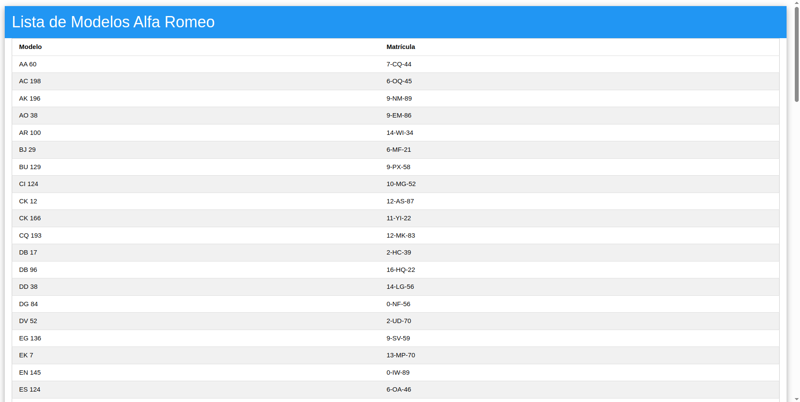

# A oficina
## A104445 - Alexandre Marques Miranda
### 
### 13/2/2025

Para este TPC, foi desenvolvido um serviço de nodejs para processar os dados da oficina de reparações através de uma aplicação web. 

Na página inicial, são apresentadas 3 opções que o utilizador pode escolher:
- Lista de Reparações
- Lista de Marcas 
- Lista de Modelos

Na página de reparações, são apresentados os dados referentes à marca e ao modelo do carro, à data da reparação e ao nome e nif do cliente. Nesta mesma página, os dados são ordenados por ordem alfabética do nome do cliente e é possível aceder a outra página que mostra todas as intervenções realizadas na reparação.

Na página de marcas, são apresentados os nomes das marcas em que foram feitas reparações. Para cada marca, é possível ver a lista de modelos e de matrículas onde se fizeram reparações.

Na página de modelos, são apresentados os nomes dos modelos em que foram feitas reparações bem como a marca a que pertence e a sua matrícula.

