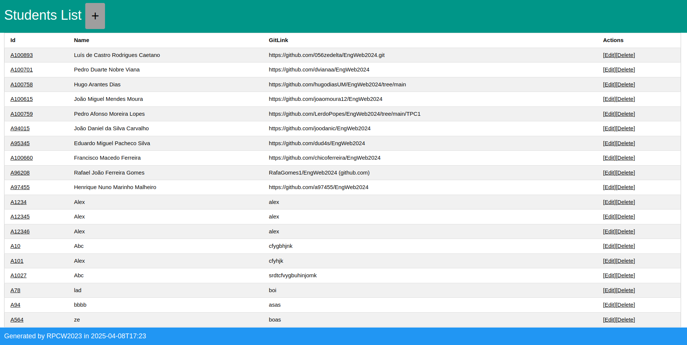
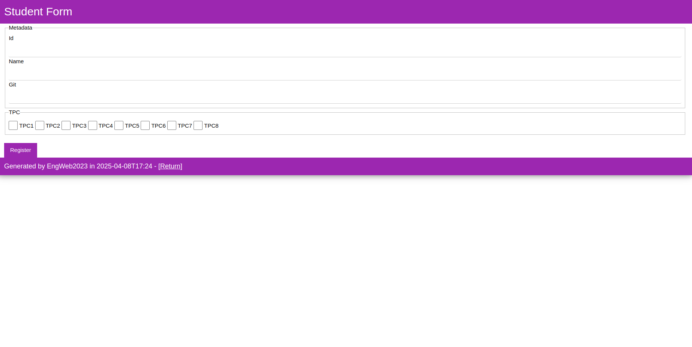
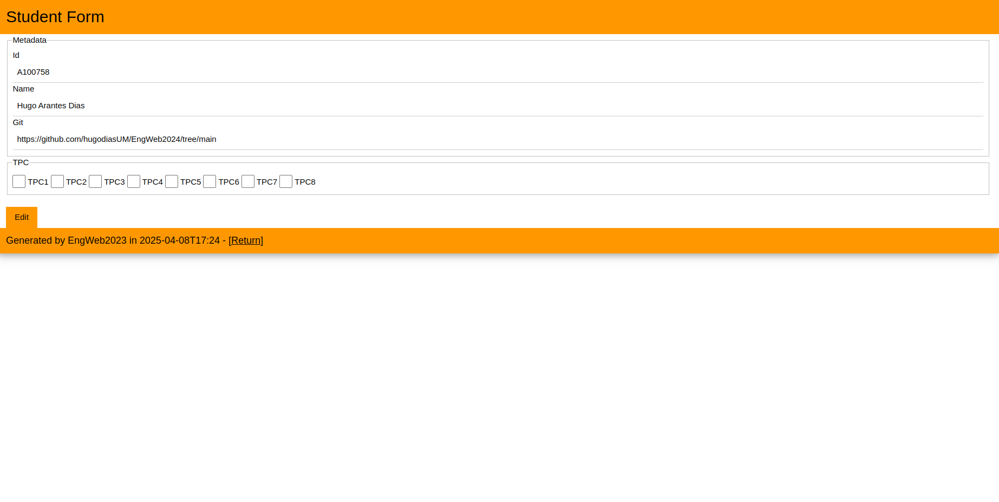
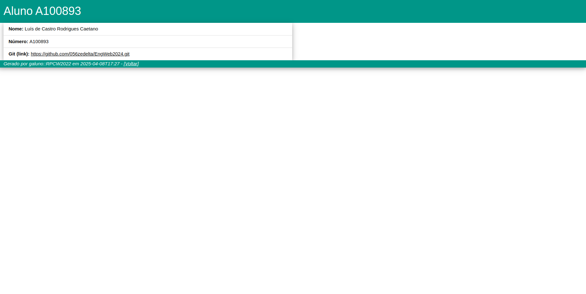

# Lista de Alunos
## A104445 - Alexandre Marques Miranda
### 
### 27/2/2025

Para este TPC, foi desenvolvido um serviço de nodejs para processar os dados de uma lista de alunos através de uma aplicação web.

Na página inicial, é possível ver a informação de todos os alunos registados.

Ao se clicar no id de um aluno, é aberta uma pagina de consulta das informações do aluno selecionado.

A partir da página inicial, é possível selecionar um aluno para editar ou apagar.

Ao ser selecionada a opção de editar, é carregado o formulário de edição em que aparecem os dados do aluno para poderem ser editados.

Ao ser selecionada a opção de apagar, o aluno é eliminado e não existe redirecionamento para nenhuma página, continuando a aparecer a lista de alunos existentes.

Também é possivel adicionar um novo registo, carregando no botão na parte superior da página inicial, que vai carregar o formulário de registo de um novo aluno.

