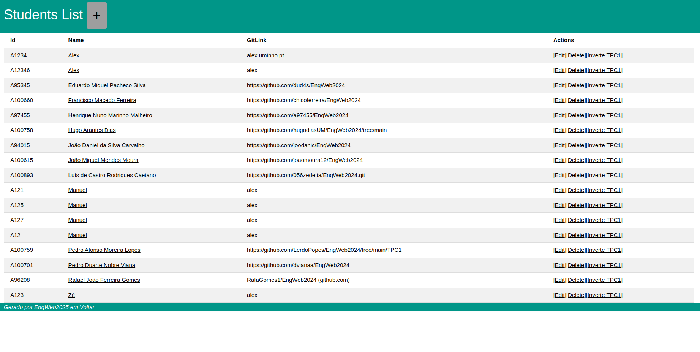
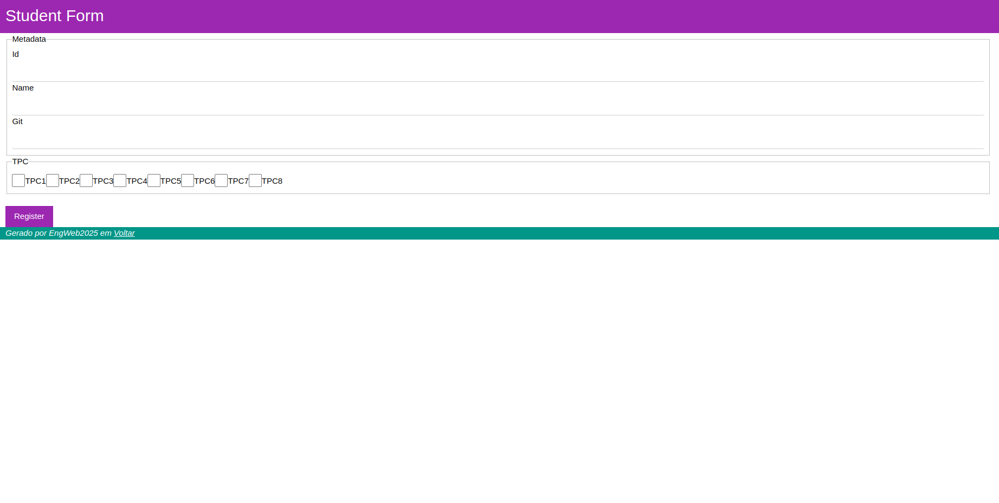
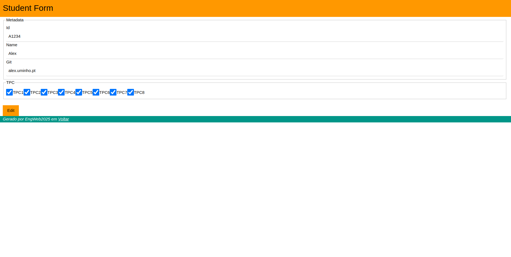
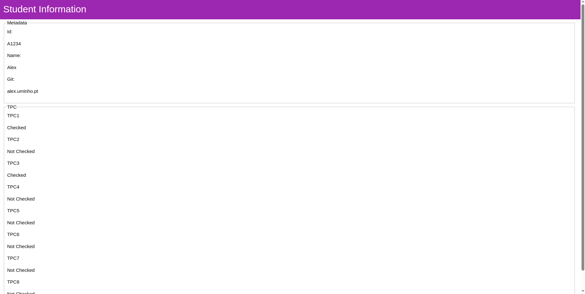

# Lista de Alunos 3
## A104445 - Alexandre Marques Miranda
### 
### 14/3/2025

Para este TPC, foi desenvolvido um serviço de nodejs utilizando a geração de código do express-generator e views em formato pug para processar os dados de uma lista de alunos através de uma aplicação web, recorrendo a uma base de dados em mongodb.

Na página inicial, é possível ver a informação de todos os alunos registados.

Ao se clicar no nome de um aluno, é aberta uma pagina de consulta das informações do aluno selecionado.

A partir da página inicial, é possível selecionar um aluno para editar, apagar ou inverter o TPC1.

Ao ser selecionada a opção de editar, é carregado o formulário de edição em que aparecem os dados do aluno para poderem ser editados.

Ao ser selecionada a opção de apagar, o aluno é eliminado e não existe redirecionamento para nenhuma página, continuando a aparecer a lista de alunos existentes.

Ao ser selecionada a opção de inverter o TPC1, a informação relativa a esse TPC é invertida, ou seja, se estiver como verdadeiro passa a falso e se estiver como falso passa a verdadeiro. Esta opção não carrega nenhum formulário, permanecendo na página de alunos.

Também é possivel adicionar um novo registo, carregando no botão na parte superior da página inicial, que vai carregar o formulário de registo de um novo aluno.

