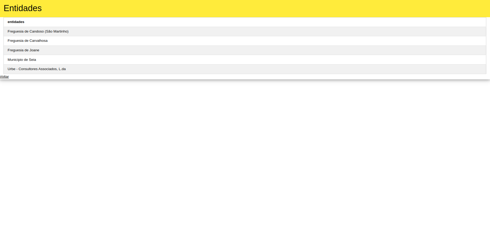

# Aplicação de Contratos Públicos
## A104445 - Alexandre Marques Miranda
### 
### 21/3/2025

Para este TPC, foi desenvolvido um serviço de nodejs utilizando a geração de código do express-generator e views em formato pug para processar os dados de uma lista de contratos públicos através de uma aplicação web, recorrendo a uma base de dados em mongodb.

Na página inicial, é possível ver a informação de todos os contratos existentes.

Ao se clicar no id de um contrato, é aberta uma página de consulta das informações do contrato selecionado.

Ao se clicar no nipc de um contrato, é aberta uma página de consulta dos contratos referentes à entidade comunicante selecionada.

A partir da página inicial, é possível selecionar um contrato para editar ou apagar.

Ao ser selecionada a opção de editar, é carregado o formulário de edição em que aparecem os dados do contrato para poderem ser editados.

Ao ser selecionada a opção de apagar, o contrato é eliminado e não existe redirecionamento para nenhuma página, continuando a aparecer a lista de contratos existentes.

Também é possivel adicionar um novo registo, carregando no botão na parte superior da página inicial, que vai carregar o formulário de registo de um novo contrato.

O url pode ser editado de algumas maneiras de forma a mostrar os dados de maneiras diferentes:
- /contratos?entidade=EEEE: devolve a lista dos contratos correspondentes à entidade
EEEE;
- /contratos?tipo=AAA: devolve a lista dos contratos com tipo de procedimento igual a AAA;
- /contratos/entidades: devolve a lista de entidades comunicantes ordenada
alfabeticamente e sem repetições;
- /contratos/tipos: devolve a lista dos tipos de procedimento ordenada alfabeticamente e
sem repetições;

